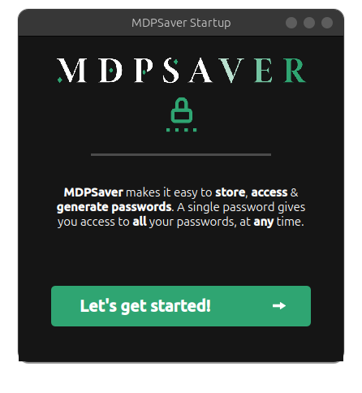
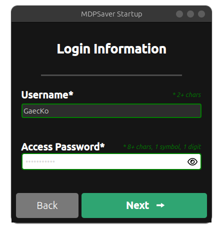
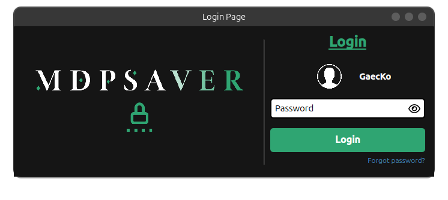

# <h1 align="center"><ins> MDPSaver</ins>  </h1>

<h1 align="center">

 

</h1>

****

**🔑 Welcome to my Password Manager App.**

### <ins> Introduction </ins> 
This app makes it easy for you to:
* **Add** your passwords
* **See** your added passwords
* **Generate** / **Create** passwords for you

All of these are done with the `pycryptodome` and `cryptography` module, to make sure everything is **secure**. By making use of these modules no lambda person will be able to access your **encrypted data**. 

**General way of working**: An **Access Password** (AP) that you create will be your **key 🔑** to all of your **saved password 🏠**. Without this AP, *none* of your password will be *readable*! All the password that you will add will be encrypted using a key which is derived from your AP, using *Fernet*, *base64.urlsafe_b64encode*, ...

****
### Standard PySide GUI
This version uses the standard PySide way to built the frontend. However, it doesn't uses any tool like `QtDesigner` or auto-generated code. As this method is long and hard to scale, we decided to switch to a [web-integration](https://github.com/GaecKo/MDPSaver/tree/web-engine-integration) version. 

This version may not be updated anymore, as the main version will be using the web-engine version. 

## Gallery 

Here is a quick look at what was designed:

