# <h1 align="center"><ins> MDPSaver</ins> v2.0.0  </h1>
# <h1 align="center"><ins> MDPSaver</ins> </h1>

<h1 align="center">

[](https://paypal.me/ArthurDeNeyer?country.x=BE&locale.x=fr_FR) 

</h1>

****

**🔑 Welcome to my Password Manager App.**

### <ins> Introduction </ins> 
This app makes it easy for you to:
* **Add** your passwords
* **See** your added passwords
* **Generate** / **Create** passwords for you
* **Filter Search** through your passwords

All of these are done with the `pycryptodome` and `cryptography` module, to make sure everything is **secure**. By making use of these modules no lambda person will be able to access your **encrypted data**. 

**General way of working**: An **Access Password** (AP) that you create will be your **key 🔑** to all of your **saved password 🏠**. Without this AP, *none* of your password will be *readable*! All the password that you will add will be encrypted using a key which is derived from your AP, using *Fernet*, *base64.urlsafe_b64encode*, ...

Status:  `▰▰▰▰▰▰▰▰▰▰ 100%` 

* [Installation](#installation)
    * [Python Script](#-python-script--)
    * [Executable]()
* [Update](#update)
* [Update notice](#update-notice)
* [Walkthrough](#walkthrough)
* [SpeedTest](#speedtest)
* [Notes](#notes)

> [!NOTE] 
> Two other version of the project exist, but are not finished & not expected to be worked on in the near feature. The terminal version is finished and complete. 
> * [web-engine-integration](https://github.com/GaecKo/MDPSaver/tree/web-engine-integration): uses PySide6 `WebEngineWidgets` for the frontend (WIP). 
> * [standard-pyside-gui](https://github.com/GaecKo/MDPSaver/tree/standard-pyside-gui): uses standard PySide6 `Layouts`, `Widgets`, ... for the frontend (WIP). Won't be worked on any longer. 
> * Each version has their own README. Click on the branch you wish to visit above to see the project itself. 

****
## Installation 

#### <ins> Python Script </ins>  

1) This app is 100% python based. To launch it as a normal python script, you need [python3.x](https://www.python.org/downloads/) to be installed on your device.

2) Once done, you will need to install some modules, simply run
    * `pip install -r requirements.txt`
    * if `pip` doesn't work, try using `pip3`
    

3) Download and unzip the files in a chosen folder. We will call it  `.../MDPSaver-master/`
4) Go into the app folder: `cd MDPSaver-master/`
5) You should see all the python scripts, open a terminal in that folder and type  `python MDPSaver.py` or `python3 MDPSaver.py`
    * If you have any issue like:
        * `FileNotFoundError`
        * `Module not found`, ...
    * Make sure you opened a terminal **IN** the `.../MDPSaver-master/.` folder! It should look like: `X:\...\MDPSaver-master\>python MDPSaver.py`
* The program should be running! Each time you want to launch MDPSaver, you need to repeat step 4 and 5!
* If you have any problem using the app, contact me on Discord: `gaecko`
****

##### Git Syncing ♻️ 
> [!TIP]
> You can quite easily add GitHub syncing on Linux + global var to launch the app:
1) Create a git repository and add the project content in it
2) Create a new file `pull.sh` in the project folder with content:
    ```bash
    (cd $1 && git pull > /dev/null 2>&1)
    ```
3) Create a new file `push.sh` in the project folder with content
    ```bash
    (cd $1 && git pull > /dev/null 2>&1 && git add . > /dev/null 2>&1 && git commit -m "Managed Passwords" > /dev/null 2>&1 && git push > /dev/null 2>&1)
    ```
4) In `MDPSaver.py`, insert after line `30` the following code:
    ```py
    if __name__ == "__main__": # this is line 30
        print(Fore.BLUE + "Git syncing ......", end=" ")

        base_dir = os.path.dirname(os.path.abspath(__file__))
        os.system(os.path.join(base_dir, f"./pull.sh {base_dir}"))
        
        print(Fore.GREEN + "\t✓")
        print(Fore.BLUE + "Launching ........", end=" ")
        sleep(0.5)
        print(Fore.GREEN + "\t✓")
        sleep(1)
        # ... Rest of the program
    ```

5) Still in `MDPSaver`, insert after line `+-445`: 
    ```py
    if choice == 8:	# this is approximately line 445
        base_dir = os.path.dirname(os.path.abspath(__file__))
        print(Fore.BLUE + "Git syncing ......", end=" ")
        os.system(os.path.join(base_dir, f"./push.sh {base_dir}"))
        print(Fore.GREEN + "\t✓")
        # ... Rest of the program
    ```
    Be careful with the indentation :). 

6) `cd` to the root folder of your system. You need to access `bin/` folder to add the MDPSaver global var. 
7) In `~/bin/`, create a file `MDPSaver` with content 
    ```bash
    python3 /../../home/USER/path_to_project/MDPSaver.py
    ```
    -> Where `USER` is your username on Linux, and `path_to_project` the path to your git folder. 

8) You can now launch the program from anywhere, by running `MDPSaver`. If you need any more help to make it work: `gaecko` on Discord. 
    


****

#### <ins> Windows Executable (.exe)  </ins>
> [!WARNING]  
> The exe version is running on an old version. If you want to have the latest version, consider using the [Python Version](#-python-script--)

* Here is a [video](https://youtu.be/CvxW0uoeJtI) on how to install MDPSaver (Easy Method). The `.exe` file is located in the [first release](https://github.com/GaecKo/MDPSaver/releases/tag/v1.0.0). 


Or follow these steps:
1) Download and extract (unzip) the files. 
2) Go into the exe folder: `./MDPSaver-master/MDP_EXE/`
3) Righ click on `MDPSaver.exe` and create a shortcut to it
4) Rename and move the shortcut on your desktop
5) Double click on the shortcut which is on your desktop, if a red window opens up, click on `more information`and then `install anyway` 
* Check the video if you have any trouble! You can also contact me on discord: `gaecko`


## Update
* If you used last version of MDPSaver, here is a [video](https://www.youtube.com/watch?v=y8biYrRKB9s) on how to update your old data to the new MDPSaver. 

> [!WARNING]  
> This works only for the exe version. For the script version, you need to launch `updator.py` within `MDPTools`. Other steps are equivalent to the one in the video.  

****

## Walkthrough 
Here is a walkthrough of the app

#### <ins> Starting Screen </ins>


#### <ins> Main Menu </ins>
* This is the Main Menu in which you can access all of the app functionnalities.


##### <ins> 1) Access my Passwords 🔎</ins>
* You can easily access your already saved password by typing one in the main menu:
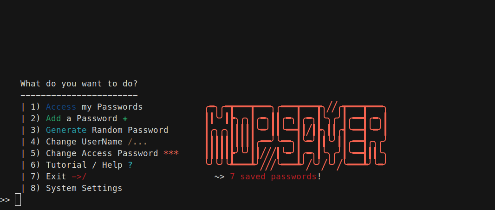
* You can then:
    * Type the number **corresponding** to the password
    * Type a **keyword** which will display corresponding password
    * Type **+** or **last password number + 1** to directly access "Add a password"
    
    * Press enter to leave

* If you reach a saved password:
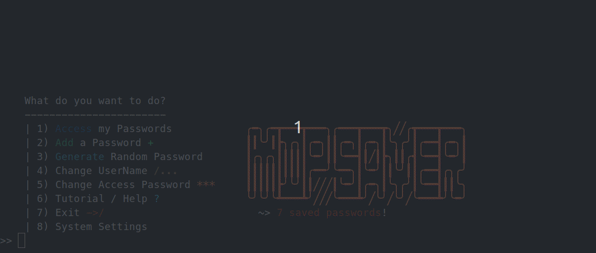
* You can then:
    * **Reveal** the password
    * **Delete** the password
    * **Change** the password
    * **Change** the *username / email*
    * Go back

##### <ins> 2) Add a password ➕</ins>
* To **add a *password***, type 2 in the main menu:

* You can then add the Site, Username / email and the password

##### <ins> 3) Generate Random Password 🔀</ins>
* The app can also generate Random Password for you. This can be usefull when signing up on new website/ ...
* The app lets you directly add the generated password to your saved password 
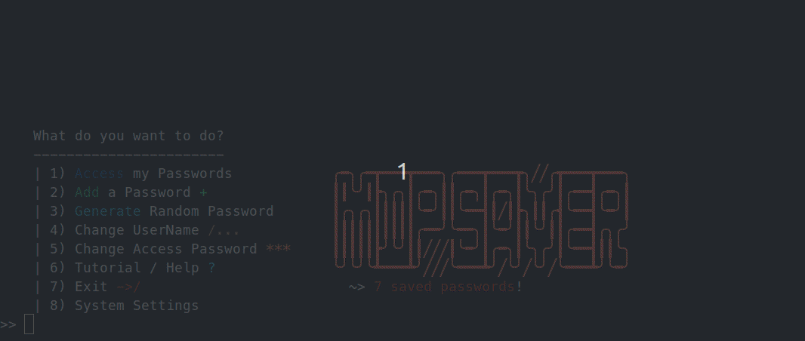
* 4 ways of generation:
    * *Weak*: only letters + numbers | size 8~12
    * *Medium*: letters + numbers + symbols | size 10~20
    * *Strong*: long + letters + numbers + symbols | size 15~25
    * *Custom*: with(out) symbols + with(out) numbers | custom size

##### <ins> 4) Filter Search 🔎</ins>
* Filter search allows you to filter and list passwords with specific information:
  * Email - Username: list all sites that have that email - username in use
  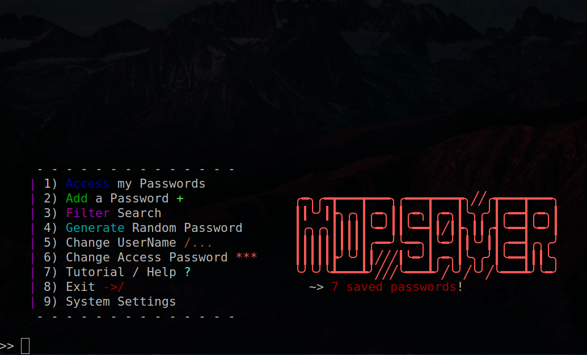
  * Password: list all sites that have that password in use
  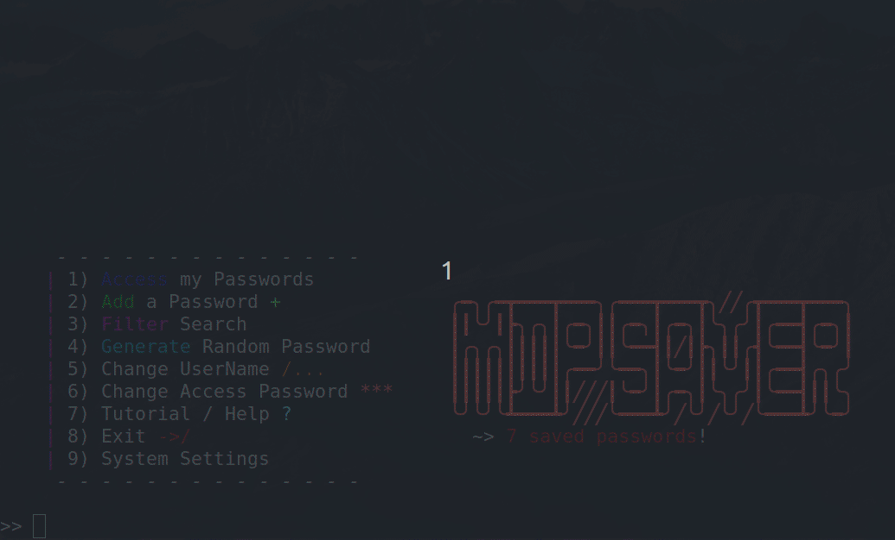


##### <ins> 5) Change Username ✒️</ins>
* If needed, you can change your **Username**:
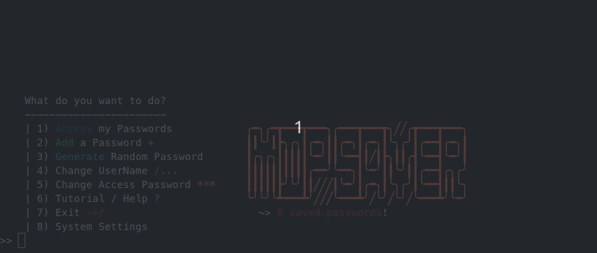

##### <ins> 6) Change Access Password 🔏</ins>
* If needed, you can change your **Access Password**:
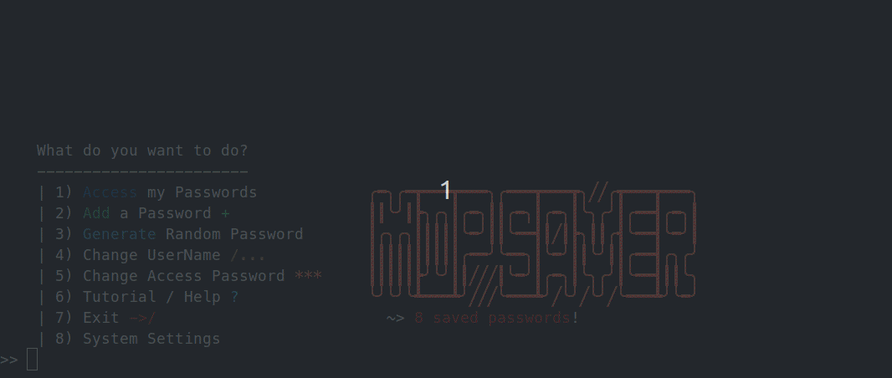
    * You will need to recreate a question and answer!

##### <ins> 7) Help / Tutorial ❓</ins>
* You can access a tutorial:


##### <ins> 8) Leave ❌</ins>
* To properly exit the program, just type 7:
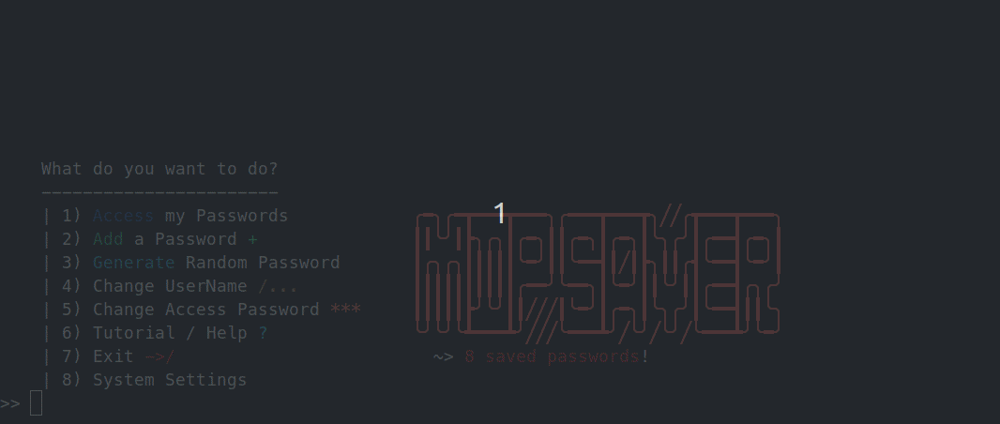
* If you are using the .exe version, the cmd window might close.

##### <ins> 9) System Settings ⚙️</ins>
* You can access some deep app setting by typing 8:
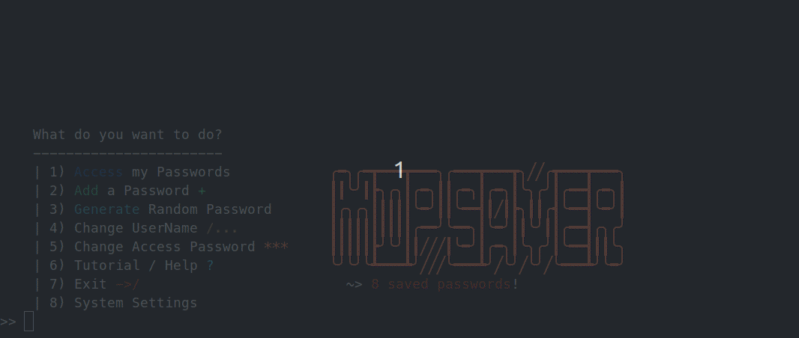
* You can then:
    * Hard Reboot Everything (reset everything)
    * Delete all password (reset data.txt)
    * Reset personnal data (this means that you will need to reconfigure the app, new AP, new question, ... If you use the same AP your password won't be lost, but it's kind of risky...)
* This menu should only be used if you plan on testing things with the code or if you have issues with the program and that loosing your password doesn't afraid you.

****


## Security 🔒
* Here is a schema on the security system:

    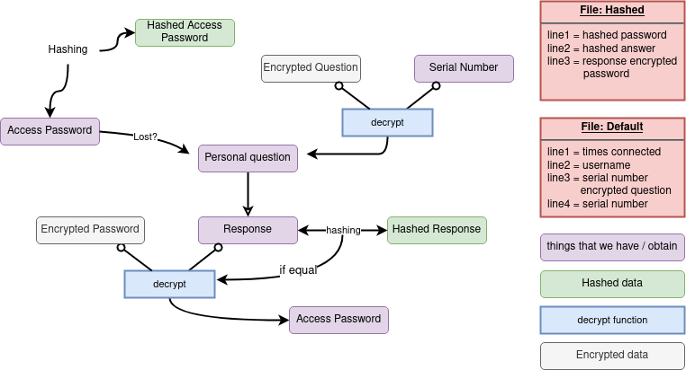


## SpeedTest 🚀
* Something I kept in mind during the project was to have a program wich was quick and simple. Starting the project I used an encode and decode function which turned out to have major security troubles, as there was an already known way on how to crack them. I then switched to an official security system (`Fernet` from `cryptography`, allied with `pycryptodome`), that I used with a key which was direved using the Access Password. That way, and with 380 000 iterations, each saved password is encrypted and safe. 

* But how about speed ? Well after hours spent on data managing and improved encryption, I now have a system which is fast enough to ensure fluent usage. 

* If you want to test speed by yourself:
    * `.\MDPSaver-master\MDPSaver-master\MDP_APP>python SpeedTest.py`
    * You will be asked how many password you want to test with, just wait a bit and some results should be displayed! 

* Result (could be influenced by the machine you use):

#### <ins> With **50 passwords**</ins>

* High security system with no improvement:
    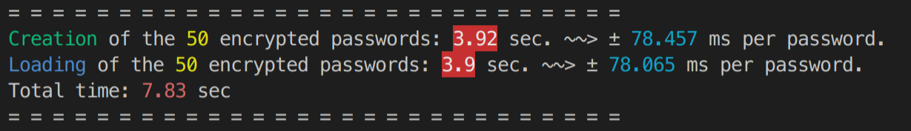
* High security system with improvement:
    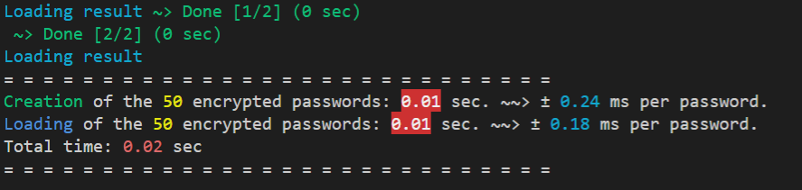

#### <ins> With **100 passwords**</ins>
* High security system with no improvement:
    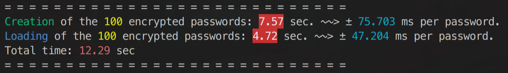
* High security system with improvement:
    

#### <ins> How I did it (*story time* 📖)</ins> 
* I used to save password this way:

        ```
        encrypted site 1 | encrypted username 1 | encrypted password 1
        encrypted site 2 | encrypted username 2 | encrypted password 2
        encrypted site 3 | encrypted username 3 | encrypted password 3
                                        ...
        ```
    It was then easy to decrypt using `string.split(" | ")` and then `decrypt(AP, string[0]), ...`. 
    
    I then simplified the process by directly encrypting the whole phrase, including the " | ". That made the encrypting and decrypting **3x** faster. 

    I would have something like this: 

    `encrypt(AP, site + " | " + username + " | " + password)`

    To then first `string = decrypt(AP, whole phrase)` and then `string.split(" | ")`. 
    
* I then figured out that the long processus of encrypting and decrypting was due to the key creation. This key is derived using the AP and is each time exactly the same. So, instead of creating for each encryption / decryption a key (which is each time the same), I would simply save it once into a program variable and re-used it for each encryption / decryption. That avoided *380 000* iterations each time. 

* To sum up, I went from:

    ```
    (3 encryption / decryption per password ) * 380 000 * numbers of password
    -> 3 * 380 000 * n = 1 140 00 iterations per password
    ```
    **TO**
    ```
    380 000 + ((1 encryption / decryption per password) * numbers of password)
    -> = 380 000 + n iterations for all of the password!
    ```
    That's how it went from `78 ms` per password to `0.24 ms`, so about `325x` quicker! Of course, as the key is loaded once, you can add / load passwords thousand of times, in the same instance of the program, and you will have almost no encryption / decryption time. 


## Notes 

* The new functionnality won't be added to the .exe version, as it would require to recompile the whole program.

* Also, as you can see within the python files:

    ```txt
    #################################################################################################
    #   | Author:       Arthur De Neyer - GaecKo                                                    #
    #   | Last update:  Check github (https://github.com/GaecKo/MDPSaver)                           #
    #                                                                                               #
    #                               ======= ⚠ DISCLAIMER ⚠ ======                                  #
    #   | This code is not suitable for professional use. As of the current state of the code, this #
    #       whole program is not sustainable and thus deprecated.                                   #
    #                                                                                               #
    #   | If you wish to rebuild the program, feel free to do it and I'll check the PR!             #
    #                                                                                               #
    #################################################################################################
    ```

    This means that I won't work on this project anymore. I might add some new features, but I won't work on the existing code itself. 

