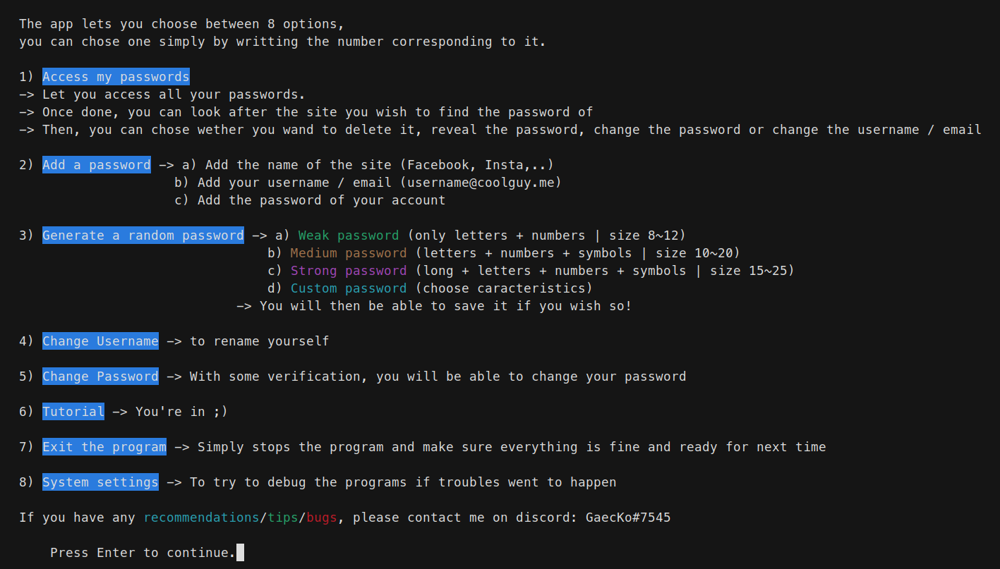

<!-- Place this tag in your head or just before your close body tag. -->

# <ins> MDPSaver </ins>  

Welcome to my **Password Manager App.** 
* **Support this Project:**

     
    

    <!-- Place this tag where you want the button to render. -->
    <a class="github-button" href="https://github.com/GaecKo" data-show-count="true" aria-label="Follow @GaecKo on GitHub">Follow @GaecKo</a>
    <!-- Place this tag where you want the button to render. -->
    <a class="github-button" href="https://github.com/GaecKo/MDPSaver/archive/master.zip" data-icon="octicon-download" aria-label="Download GaecKo/MDPSaver on GitHub">Download</a>
    <!-- Place this tag where you want the button to render. -->
    <a class="github-button" href="https://github.com/GaecKo/MDPSaver" data-icon="octicon-star" data-show-count="true" aria-label="Star GaecKo/MDPSaver on GitHub">Star</a>

### <ins> Introduction </ins> 
This app makes it easy for you to:
* **Add** your passwords
* **See** your added passwords
* **Generate** / **Create** passwords for you

All of these are done with the `pycryptodome` and `cryptography` module, to make sure everything is **secure**. By making use of these modules no lambda person will be able to access your **encrypted data**. 

**General way of working**: An **Access Password** (AP) that you create will be your **key 🔑** to all of your **saved password 🏠**. Without this AP, *none* of your password will be *readable*! All the password that you will add will be encrypted using a key which is derived from your AP, using *Fernet*, *base64.urlsafe_b64encode*, ...

Status:  `▰▰▰▰▰▰▰▰▰▰ 100%` 
 

****

## Installation 

#### <ins> Windows Executable (.exe) 🪟 </ins>
* Here is a [video](https://youtu.be/CvxW0uoeJtI) on how to install MDPSaver (Easy Method)

Or follow these steps:
1) Download and extract (unzip) the files. 
2) Go into the exe folder: `./MDPSaver-master/MDP_EXE/`
3) Righ click on `MDPSaver.exe` and create a shortcut to it
4) Rename and move the shortcut on your desktop
5) Double click on the shortcut which is on your desktop, if a red window opens up, click on `more information`and then `install anyway` 
* Check the video if you have any trouble! You can also contact me on discord: `GaecKo#7545`

#### <ins> Python Script </ins>  

1) This app is 100% python based. To launch it as a normal python script, you need [python3.x](https://www.python.org/downloads/) to be installed on your device.
    * Please make sure that you cross the pip option in the installation wizard as well!
2) Once done, you will need to install some modules:
    * `pip install cryptography`
    * `pip install pycryptodome`
    * `pip install pwinput`
    * `pip install colorama`
    * if `pip` doesn't work, try using `pip3`
    * You now have the prerequired modules to continue!

3) Download and unzip the files
4) Go into the app folder: `./MDPSaver-master/MDP_APP/`
5) You should see all the python scripts, open a terminal in that folder and type  `python MDPSaver.py` or `python3 MDPSaver.py`
    * If you have any issues like:
        * `FileNotFoundError`
        * `Module not found`, ...
    * Make sure you opened a terminal **IN** the `MDP_APP/` folder! It should look like: 
    
    `X:\...\MDPSaver-master\MDPSaver-master\MDP_APP>python MDPSaver.py  `
* The program should be running! Each time you want to launch MDPSaver, you need to repeat step 4 and 5!
* If you have any problem using the app, contact me on Discord: `GaecKo#7545`
****

## Walkthrough 
Here is a walkthrough of the app

#### <ins> Starting Screen </ins>

#### <ins> Main Menu </ins>
* This is the Main Menu in which you can access all of the app functionnalities.

##### <ins> 1) Access my Passwords 🔎</ins>
* You can easily access your already saved password by typing one in the main menu:

* You can then:
    * Type the number **corresponding** to the password
    * Type a **keyword** which will display corresponding password
    * Type **+** or **last password number + 1** to directly access "Add a password"
    
    * Press enter to leave

* If you reach a saved password:

* You can then:
    * **Reveal** the password
    * **Delete** the password
    * **Change** the password
    * **Change** the *username / email*
    * Go back

##### <ins> 2) Add a password ➕</ins>
* To **add a *password***, type 2 in the main menu:

* You can then add the Site, Username / email and the password

##### <ins> 3) Generate Random Password 🔀</ins>
* The app can also generate Random Password for you. This can be usefull when signing up on new website/ ...
* The app lets you directly add the generated password to your saved password 

* 4 ways of generation:
    * *Weak*: only letters + numbers | size 8~12
    * *Medium*: letters + numbers + symbols | size 10~20
    * *Strong*: long + letters + numbers + symbols | size 15~25
    * *Custom*: with(out) symbols + with(out) numbers | custom size

##### <ins> 4) Change Username ✒️</ins>
* If needed, you can change your **Username**:

##### <ins> 5) Change Access Password 🔏</ins>
* If needed, you can change your **Access Password**:

    * You will need to recreate a question and answer!

##### <ins> 6) Help / Tutorial ❓</ins>
* You can access a tutorial:

##### <ins> 7) Leave ❌</ins>
* To properly exit the program, just type 7:

* If you are using the .exe version, the cmd window might close.

##### <ins> 8) System Settings ⚙️</ins>
* You can access some deep app setting by typing 8:

* You can then:
    * Hard Reboot Everything (reset everything)
    * Delete all password (reset data.txt)
    * Reset personnal data (this means that you will need to reconfigure the app, new AP, new question, ... If you use the same AP your password won't be lost, but it's kind of risky...)
* This menu should only be used if you plan on testing things with the code or if you have issues with the program and that loosing your password doesn't afraid you.

